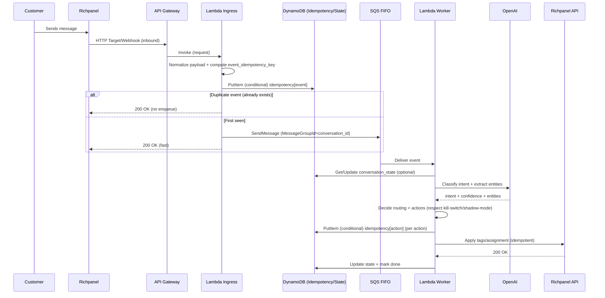
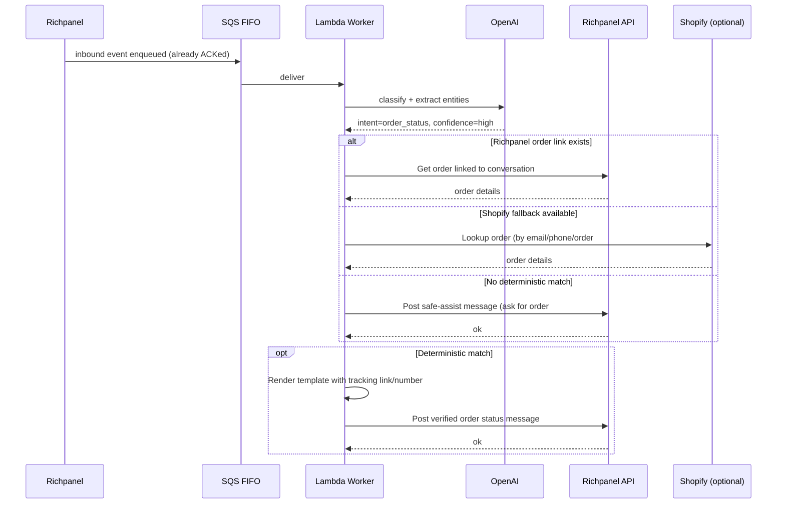
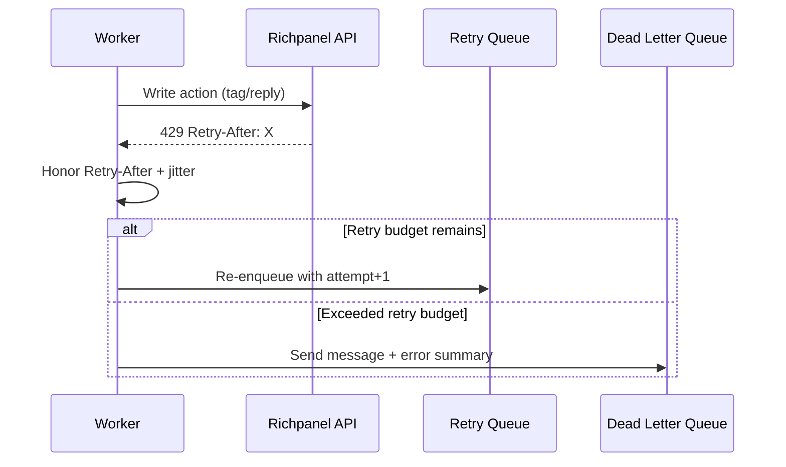

# Sequence Diagrams

Last updated: 2025-12-21
Last verified: 2025-12-21 — Added idempotency + kill switch notes.

This file uses Mermaid diagrams to describe key runtime flows.

---

## 1) Inbound message → route to a department/team (ACK-fast + idempotency)

---

## 2) Order status: verified auto-reply (template-based)

---

## 3) Rate limit hit (429) → backoff + retry path (simplified)

