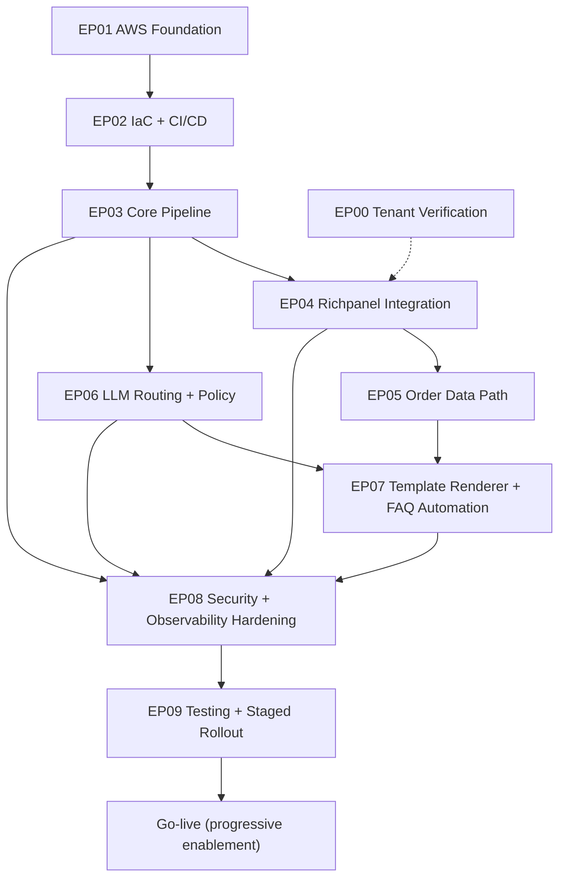

# Dependency Map (Epics)

Last updated: 2025-12-29

This graph shows epic-level dependencies. Use it to schedule work and parallelize safely.

---

## 0) Purpose

- Use this map to understand **epic-level dependencies** and to parallelize work safely.
- Treat this as a planning artifact; implementation details live in the epic specs under `docs/12_Cursor_Agent_Work_Packages/02_Epics/`.

## 1) Epic dependency graph

## 2) Notes

- EP00 is “soft dependency” (dashed) because safe defaults exist, but it must be completed before final go-live decisions (webhook auth, order linkage reality).
- EP08 should not be postponed until the end. Minimum security + monitoring must exist before enabling automation.

---

## 3) Change protocol

- If an epic is added/removed/renamed, update this graph in the same commit as the epic change.
- Keep epic IDs stable (`EP01`, `EP02`, `EP03+`).
